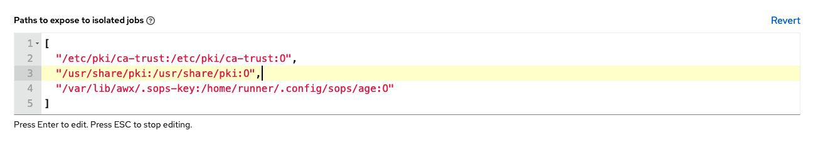

Today, I am excited to share how to set up an Ansible execution environment to control SOPS secrets. The Ansible execution image is a pre-built container containing all the necessary components for decrypting SOPS secrets in Ansible playbooks.

[Ansible Builder](https://ansible-builder.readthedocs.io/en/stable/) is a tool that can help with building the image

* Let's start by creating a new working directory

  ```bash
  mkdir custom-ansible-execution; cd custom-ansible-execution
  ```

* Add an `execution-environment.yml` file. ansible-builder build container images with the definition file `execution-environment.yml`

  ```yaml
  version: 1
  build_arg_defaults:
    EE_BASE_IMAGE: 'registry.redhat.io/ansible-automation-platform-22/ee-supported-rhel8:latest'
  additional_build_steps:
    prepend: |
      RUN pip3 install --upgrade pip setuptools
  dependencies:
    galaxy: requirements.yml
  ```

* Create and add the SOPS collection to the `requirements.yml`

  ```yaml
  collections:
    - community.sops
  ```

* Generate the `Containerfile`

  ```bash
  ansible-builder create
  Complete! The build context can be found at: custom-ansible-execution/context
  ```

* Update the `Containerfile`  in the context directory to add SOPS rpm into the container and create new directories to mount the key file

  ```Dockerfile
  FROM $EE_BASE_IMAGE
  USER root
  RUN pip3 install --upgrade pip setuptools
  RUN rpm -i https://github.com/mozilla/sops/releases/download/v3.7.3/sops-3.7.3-1.x86_64.rpm && \
      sops -v && \
      mkdir -p /home/runner/.config/sops/age
      
  COPY --from=galaxy /usr/share/ansible /usr/share/ansible

  COPY --from=builder /output/ /output/
  RUN /output/install-from-bindep && rm -rf /output/wheels
  LABEL ansible-execution-environment=true
  ```

* Build the container image using Podman and push to a registry

  ```bash
  podman build -f context/Containerfile -t localhost/custom-ee:1.0 context
  podman push ...
  ```

* Follow this [guide](https://docs.ansible.com/automation-controller/latest/html/userguide/execution_environments.html#use-an-execution-environment-in-jobs) to add an execution environment in Jobs

* Mount the SOPS keys to decrypt using [Execution environment mount options](https://docs.ansible.com/automation-controller/latest/html/userguide/execution_environments.html#execution-environment-mount-options)

  

* Finally, SSH into the ansible controller and change to awx user to copy the key into the appropriate directory

  ```bash
  ssh aap-controller
  sudo su - awx
  sudo mkdir -p /var/lib/awx/.sops-key
  sudo mv keys.txt /var/lib/awx/.sops-key 
  ```

Thank you for taking the time to read my blog post. Until next time, take care!
