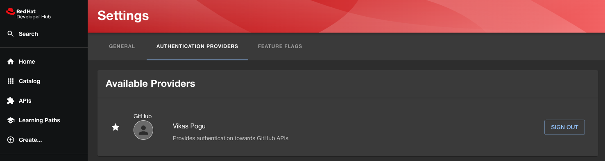
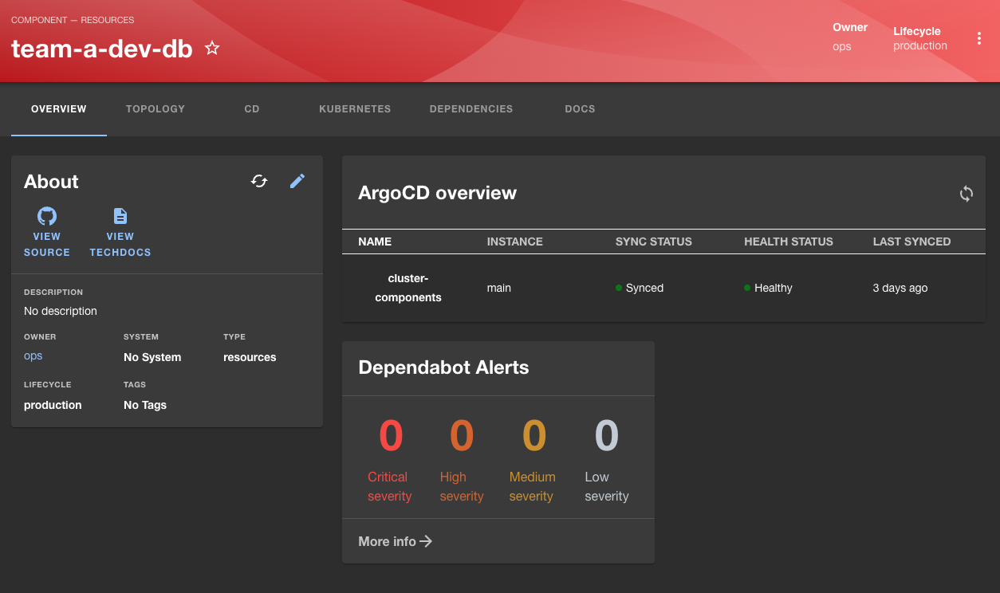

+++
title = 'Getting Started with Red Hat Developer Hub - Part 1'
date = 2024-01-13T11:51:33-06:00
draft = false
tags=["Red Hat Developer Hub","Backstage","IDP"]
+++

## Introduction

Red Hat Developer Hub is based on Spotify's open-sourced [backstage](https://backstage.io/docs/overview/what-is-backstage) project. Backstage is an open-source developer portal and a platform for building developer experiences. It's designed to centralize and streamline various aspects of the software development life cycle, providing a unified platform for developers, product managers, and other stakeholders. Here are some key features and advantages of Spotify Backstage: Unified Platform, Service Catalog, Documentation Hub, Plugin Architecture and more.

Today, I'm excited to share my learnings on the journey of getting started with the Red Hat Developer Hub. Join me as we explore the how to deploy it using Helm chart, enabling diverse plugins, and configuring integrations with GitHub, ArgoCD, Open Cluster Management. To add a cherry on top, we'll create a software template that opens a GitHub pull request to provision a database cluster using [CloudNative-PG](https://cloudnative-pg.io/).

## Installation

Deploying the Red Hat Developer Hub is a breeze, and Helm charts make it a cinch. First, add the helm chart repo for the developer hub. Then, we'll download the values yaml since we need to update a few values accordingly.

```bash
helm repo add developer-hub https://redhat-developer.github.io/helm-charts
helm show values openshift-helm-charts/redhat-developer-hub > values.yaml
```

Update the `global.clusterRouterBase` according to OpenShift router host and modify values if needed


global:
  auth:
    backend:
      enabled: true
      existingSecret: ""
      value: ""
  clusterRouterBase: apps.example.com
...


Install the helm chart with modified values

```bash
helm install developer-hub developer-hub/developer-hub -f values.yaml
```

Wait for the developer hub and postgresql database pods to be in ready status

```bash
oc get pods
NAME                             READY   STATUS    RESTARTS   AGE
developer-hub-64d8cff99c-k8k9r   1/1     Running   0          2d
developer-hub-postgresql-0       1/1     Running   0          2d
```

Navigate to the developer hub in a web browser by grabbing the route host information as shown below

```bash
oc get routes
NAME            HOST/PORT                                         PATH   SERVICES        PORT           TERMINATION     WILDCARD
developer-hub   developer-hub-developer-hub.apps.example.com   /      developer-hub   http-backend   edge/Redirect   None
```

Voila, you have successfully deployed the developer hub!

## Plugins

Red Hat Developer Hub's power lies in its extensibility through plugins. Let's delve into enabling some key [plugins](https://backstage.io/docs/plugins/)

In this post, I'll we will cover how to integrate below plugins

- Kubernetes
- GitHub for authentication
- Open Cluster management to show cluster details
- ArgoCD for Sync status

### Enable plugins

Developer Hub images are pre-packaged with some dynamic [plugins](https://access.redhat.com/documentation/en-us/red_hat_developer_hub/1.0/html/administration_guide_for_red_hat_developer_hub/rhdh-installing-dynamic-plugins#rhdh-supported-plugins). Most of these plugins are disabled by default since they must be configured. To enable plugins, add a package, set the disabled to false in the Helm Chart values under the dynamic plugins section


global:
  auth:
    backend:
      enabled: true
      existingSecret: ""
      value: ""
  clusterRouterBase: apps.example.com
  dynamic:
    includes:
      - dynamic-plugins.default.yaml
    plugins:
      - disabled: false
        package: ./dynamic-plugins/dist/backstage-plugin-catalog-backend-module-github-dynamic
      - disabled: false
        package: ./dynamic-plugins/dist/roadiehq-backstage-plugin-security-insights
      - disabled: false
        package: ./dynamic-plugins/dist/backstage-plugin-kubernetes-backend-dynamic
      - disabled: false
        package: ./dynamic-plugins/dist/backstage-plugin-kubernetes
      - disabled: false
        package: ./dynamic-plugins/dist/roadiehq-backstage-plugin-argo-cd-backend-dynamic
      - disabled: false
        package: ./dynamic-plugins/dist/roadiehq-scaffolder-backend-argocd-dynamic
      - disabled: false
        package: ./dynamic-plugins/dist/roadiehq-backstage-plugin-argo-cd
      - disabled: false
        package: ./dynamic-plugins/dist/janus-idp-backstage-plugin-ocm
      - disabled: false
        package: ./dynamic-plugins/dist/janus-idp-backstage-plugin-ocm-backend-dynamic
      - disabled: false
        package: ./dynamic-plugins/dist/roadiehq-scaffolder-backend-module-utils-dynamic
...


Re-install the chart with updated values

```bash
helm upgrade --install developer-hub developer-hub/developer-hub -f values.yaml
```

Verify if plugins are installed in the `install-dynamic-plugins init container` within the Developer Hub pod’s log

```log
======= Skipping disabled dynamic plugin ./dynamic-plugins/dist/backstage-plugin-scaffolder-backend-module-gitlab-dynamic
======= Installing dynamic plugin ./dynamic-plugins/dist/backstage-plugin-kubernetes-backend-dynamic
	==> Grabbing package archive through `npm pack`
	==> Removing previous plugin directory /dynamic-plugins-root/backstage-plugin-kubernetes-backend-dynamic-0.13.0
	==> Extracting package archive /dynamic-plugins-root/backstage-plugin-kubernetes-backend-dynamic-0.13.0.tgz
	==> Removing package archive /dynamic-plugins-root/backstage-plugin-kubernetes-backend-dynamic-0.13.0.tgz
	==> Merging plugin-specific configuration
	==> Successfully installed dynamic plugin /opt/app-root/src/dynamic-plugins/dist/backstage-plugin-kubernetes-backend-dynamic
======= Installing dynamic plugin ./dynamic-plugins/dist/backstage-plugin-kubernetes
	==> Grabbing package archive through `npm pack`
	==> Removing previous plugin directory /dynamic-plugins-root/backstage-plugin-kubernetes-0.11.0
	==> Extracting package archive /dynamic-plugins-root/backstage-plugin-kubernetes-0.11.0.tgz
	==> Removing package archive /dynamic-plugins-root/backstage-plugin-kubernetes-0.11.0.tgz
	==> Merging plugin-specific configuration
	==> Successfully installed dynamic plugin /opt/app-root/src/dynamic-plugins/dist/backstage-plugin-kubernetes
======= Installing dynamic plugin ./dynamic-plugins/dist/janus-idp-backstage-plugin-topology
```

## Plugin Integrations

> In the spirit of brevity and to ensure accuracy, I've posted the configuration code snippets for your convenience. However, for a more detailed and nuanced understanding of the integration process, I highly recommend referring to the official product documentation.

### Externalize configuration

Create a `configmap` to add configuration to the developer hub as described in the [documentation](https://access.redhat.com/documentation/en-us/red_hat_developer_hub/1.0/html/getting_started_with_red_hat_developer_hub/ref-rhdh-supported-configs_rhdh-getting-started)


Integration code snippets are added to the configmap; for reference, here is the complete [configmap](https://raw.githubusercontent.com/Vikaspogu/openshift-multicluster/main/kustomize/cluster-overlays/pxm-acm/developer-hub-chart/app-config-rhdh.yaml)


### GitHub Integration

Seamlessly connect your projects with GitHub by configuring the [integration](https://access.redhat.com/documentation/en-us/red_hat_developer_hub/1.0/html/getting_started_with_red_hat_developer_hub/ref-rhdh-supported-configs_rhdh-getting-started#setting-github-integration-and-authentication).

```yaml
auth:
  # see https://backstage.io/docs/auth/ to learn about auth providers
  environment: development
  providers:
    github:
      development:
        clientId: ${GITHUB_APP_CLIENT_ID}
        clientSecret: ${GITHUB_APP_CLIENT_SECRET}
```



### Navigating Clusters with Open Cluster Management

Open Cluster Management extends our reach to manage and monitor multiple clusters effortlessly. To enable we can add kubernetes [configuration](https://backstage.io/docs/features/kubernetes/configuration) and reference the cluster in catalog provider

```yaml
kubernetes:
  serviceLocatorMethod:
    type: "multiTenant"
  clusterLocatorMethods:
    - type: "config"
      clusters:
        - url: https://api.example.com:6443
          name: acm
          authProvider: "serviceAccount"
          skipTLSVerify: true
          serviceAccountToken: ${KUBE_TOKEN}
          dashboardApp: openshift
          dashboardUrl: https://console-openshift-console.apps.example.com/
catalog:
  providers:
    ocm:
      default:
        kubernetesPluginRef: acm #same as the clusters name in kubernetes section
        name: multiclusterhub
        owner: group:ops
        schedule:
          frequency:
            seconds: 10
          timeout:
            seconds: 60
```


### Synchronizing with ArgoCD

The ArgoCD Backstage plugin provides synced, health status and updates the history of your services to your Developer Portal. Add the `ARGOCD_TOKEN` as an environment variable, or create a secret and add it from secret.

```yaml
argocd:
  appLocatorMethods:
    - instances:
        - name: main
          token: ${ARGOCD_TOKEN}
          url: https://openshift-gitops-server-openshift-gitops.apps.example.com
      type: config
```



## Conclusion

🛠️ That's a Wrap for Part 1! Stay Tuned for Part 2

In Part 1, we've navigated through installation, enabled plugins, configured the integration, and set the stage for a seamless developer experience.

In our upcoming Part 2, we'll dive into the magic of software template creation.
