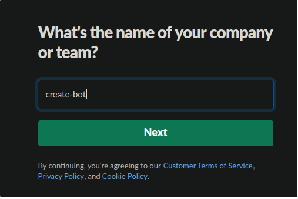
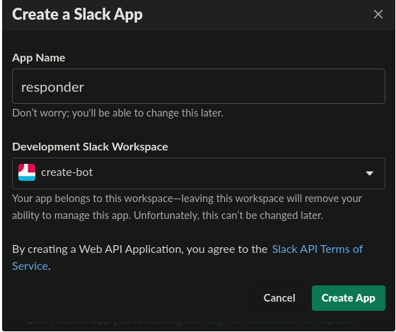
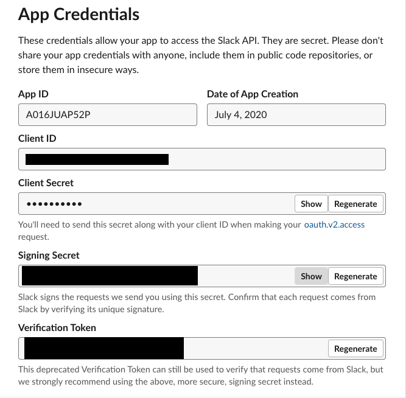
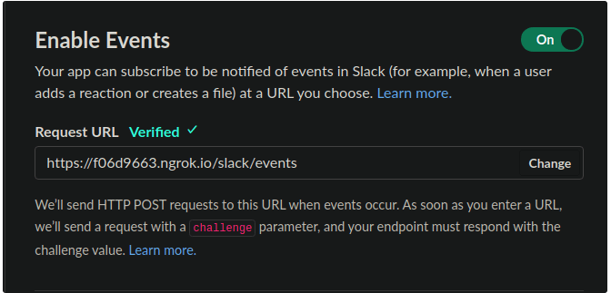

+++ 
date = 2020-07-04
title = "Slack bot with Nodejs"
description = "Building a slack bot using bolt library in Nodejs"
slug = "nodejs-slack-bot" 
tags = ["slack-bot", "nodejs"]
categories = []
externalLink = ""
series = []
+++

Build your own personal slack bot in few steps. In this post we'll navigate through process of creating the bot.

## Slack setup

First create a slack [workspace](https://slack.com/intl/en-ng/create#email)

- Give your workspace a name



Create a new bot at [slack apps](https://api.slack.com/apps)

- Give your new app a name
- Choose workspace you created before to install the app



Then go to `Features > OAuth & Permissions` screen to scroll down to `Bot Token Scopes` to specify the OAuth scopes, select `app_mentions` and `chat_write` to enable the bot to send messages.


Before jumping into application setup, let's copy signing secret and verification token from basic information page. we'll be using this later in our nodejs application



## Application setup

Create a npm project, install `@slack/bolt` and `dotenv` packages

```bash
mkdir test-bot && cd test-bot
npm init -y
npm i dotenv @slack/bolt -S
```

Add start command to scripts if necessary

```json
...
"scripts": {
  "start": "node index.js"
}
```

Create a `.env` file and add `SLACK_SIGNING_SECRET`, `SLACK_BOT_TOKEN`

**Note:** Don't commit this file to any repo

```env
SLACK_BOT_TOKEN= #token goes here
SLACK_SIGNING_SECRET= #signing secret goes here
```

In your index.js file, require the Bolt package, and initialize an app with credentials

```javascript
require("dotenv").config();
const { App } = require("@slack/bolt");

const bot = new App({
  signingSecret: process.env.SLACK_SIGNING_SECRET,
  token: process.env.SLACK_BOT_TOKEN,
  endpoints: "/slack/events",
});

(async () => {
  // Start the app
  await bot.start(process.env.PORT || 3000);

  console.log("⚡️ Bolt app is running!");
})();
```

Deploy application to a live server like `ngrok`.

#### Event Setup

We'll need to subscribe to events, so that when a Slack event happens (like a user mentions app), app server will receive an event payload

- Go to Event Subscriptions from the left-hand menu, and turn the toggle switch on to enable events

- Enter your Request URL



Subscribe to `app_mention` event


Install app to workspace


You should see bot in your workspace now!

#### Handling Events

To listen to any Events API events from Slack, use the event() method. This allows your app to take action when something happens in Slack. In this scenario, it's triggered when a user mentions app.

```javascript
bot.event("app_mention", async ({ context, event }) => {
  try {
    const command = event.text;
    let reply;
    if (command.includes("Hi")) {
      reply = `Hi <@${event.user}>,  you mentioned me`;
    } else {
      reply = "How can i help you?";
    }
    await bot.client.chat.postMessage({
      token: context.botToken,
      channel: event.channel,
      text: `${reply}`,
    });
  } catch (e) {
    console.log(`error responding ${e}`);
  }
});
```

Okay, let's try the app!

Add app to a channel and mention the app. You should see a response from bot!

### Troubleshooting

Reinstall app if you don't see any responses from bot


