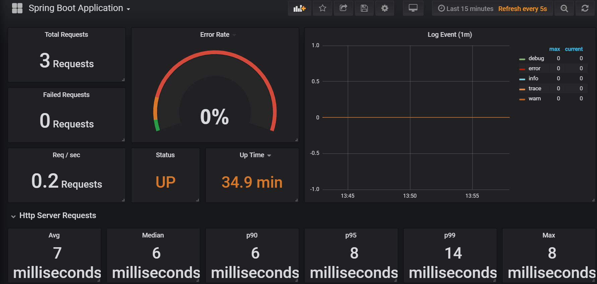

+++
title= "Spring Boot metrics with Prometheus and Grafana in OpenShift"
date= "2019-05-15"
tags= ["OpenShift", "Spring Boot", "Prometheus", "Grafana"]
slug="springboot-metrics-grafana"
socialShare=true
+++

## Spring Boot Metrics

In this post I'll discuss how to monitor spring boot application metrics using Prometheus and Grafana.

### [Prometheus](https://prometheus.io/)

Prometheus is a monitoring system which collects metrics from configured targets at given intervals.

### [Grafana](https://grafana.com/docs/)

Grafana is an open source metric analytics & visualization tool.

### [Micrometer](https://micrometer.io/)

Micrometer is a metrics instrumentation library for JVM-based applications.

### [Spring Boot Actuator](https://docs.spring.io/spring-boot/docs/current/reference/html/production-ready-endpoints.html)

Spring Boot Actuator helps you monitor and manage your application when it’s pushed to production. You can choose to manage and monitor your application using HTTP or JMX endpoints.

### Setup

Enable prometheus metrics by adding dependencies in `pom.xml`

```xml
<dependency>
    <groupId>org.springframework.boot</groupId>
    <artifactId>spring-boot-starter-actuator</artifactId>
</dependency>
<dependency>
    <groupId>io.micrometer</groupId>
    <artifactId>micrometer-core</artifactId>
    <version>1.1.4</version>
</dependency>
<dependency>
    <groupId>io.micrometer</groupId>
    <artifactId>micrometer-registry-prometheus</artifactId>
    <version>1.0.6</version>
</dependency>
```

By default `prometheus` endpoint is not available and must be enabled in `application.properties`. More configurations can be found at spring-boot [docs](https://docs.spring.io/spring-boot/docs/current/reference/htmlsingle/#production-ready-metrics)

```properties
#Metrics related configurations
management.endpoint.metrics.enabled=true
management.endpoints.web.exposure.include=*
management.endpoint.prometheus.enabled=true
management.metrics.export.prometheus.enabled=true
management.metrics.distribution.percentiles-histogram.http.server.requests=true
management.metrics.distribution.sla.http.server.requests=1ms,5ms
management.metrics.distribution.percentiles.http.server.requests=0.5,0.9,0.95,0.99,0.999
```

Optionally register any number of `MeterRegistryCustomizer` to further configure the registry (such as applying common tags) before any meters are registered with the registry.

```java
@Bean
MeterRegistryCustomizer<MeterRegistry> metricsCommonTags() {
    return registry -> registry.config().commonTags("application", "sample-app");
}
```

Create a new project; deploy the application and prometheus in OpenShift.

```bash
$ oc project myproject
$ oc new-app redhat-openjdk18-OpenShift~<git_repo_URL> -n sample-app
oc new-app prom/prometheus -n prometheus
```

In order to keep the prometheus image and configuration decoupled, use the `ConfigMap` object to inject our the Prometheus deployment with the appropriate configuration data

```bash
cat <<'EOF' > prometheus.yml
global:
  scrape_interval:     5s
  evaluation_interval: 5s

scrape_configs:
  - job_name: 'sample-app'
    metrics_path: '/actuator/prometheus'
    static_configs:
    - targets: ['sample-app:8080']

EOF

oc create configmap prom-config-example --from-file=prometheus.yml
```

Next, edit the deployment configuration for Prometheus to include this ConfigMap.

```bash
oc edit dc/prometheus
```

Add new volume and volume mount

```bash
- name: prom-config-example-volume
   configMap:
     name: prom-config-example
     defaultMode: 420

- name: prom-config-example-volume
  mountPath: /etc/prometheus/
```

Use an OpenShift Template to run Grafana with persistent storage.

```bash
$ oc process -f https://gist.githubusercontent.com/Vikaspogu/4a67495acf8dba5dc94837e031129fde/raw/e88f42515c6ed101c9554c7c2425794e80e10a64/OpenShift-grafana.yaml | oc apply -f-
```

Once deployed, log-in to Grafana using the Route provided in the Template and using default account admin with password admin (it maybe a good idea to change the password after this).

### Grafana Data Source

1. The Grafana template automatically provisions a Prometheus data source `App-Prometheus` which connects to `http://prometheus:9090` via proxy connection.

2. This works only if there is a Prometheus service (called prometheus) in the same project as Grafana. If this is not the case, it is necessary to edit the datasource to point to another location.

### Grafana Dashboard

1. The Grafana template automatically provisions sample dashboards. These dashboards are by no means comprehensive but could be used as a starting point for further customization.



You can find more official & community built grafana dashboards [here](https://grafana.com/dashboards?dataSource=prometheus&search=Micrometer)
