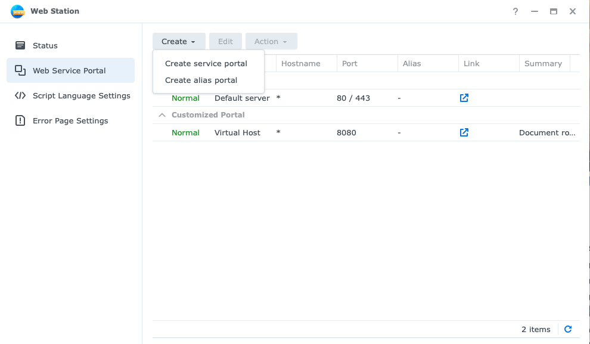
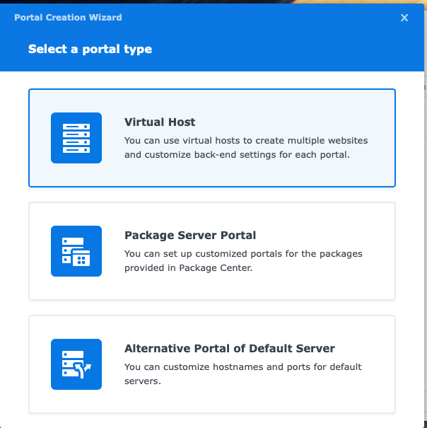
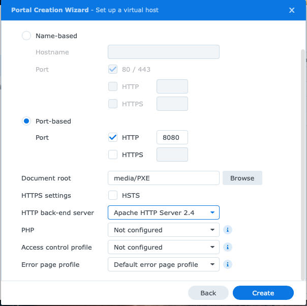
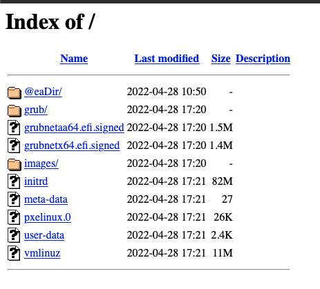

In this post, I have documented the steps I followed to install RHEL 8 by booting from a PXE server over the network with a Kickstart file using Synology NAS as TFTP, HTTP server, and UDM as DHCP.

1. [Install & Configure TFTP](#install-and-configure-tftp)
2. [Install & Configure HTTP server](#install-and-configure-http-server)
3. [Enable network boot on UDM](#enable-network-boot-udm)
4. [PXE Boot setup](#pxe-boot-setup)
    * [Prepare Installation Repository](#prepare-installation-repository)
    * [Prepare kickstart file](#prepare-kickstart-file)
    * [Perform PXE boot](#perform-pxe-boot)

## Install and Configure TFTP

Trivial File Transfer Protocol (TFTP) is a simple file transfer protocol, generally used for transferring configurations or boot files when authentication is not required.

Synology NAS comes with TFTP file services

### To configure TFTP

Go to `Control Panel` > `File Services` > `Advanced`

1. Select `Enable TFTP Service`
2. In the TFTP root folder field, specify which folder on the Synology NAS can be accessed by TFTP clients


## Install and Configure HTTP server

We also need a service to host our image repository, we can use FTP or HTTP, or NFS to host our image repository. Synology NAS comes with web hosting features. In Web Station, we will create a port-based virtual host to host the contents of our image repository.

Install the following packages from the Synology package center

* Web Station
* Apache HTTP Server 2.4

### Create a virtual host

Open `Web Station` and go to `Web Service Portal` > Select `Create Service Portal`



Select `Virtual Host`



In the virtual host wizard

* Select Port-based with protocol as `HTTP` and enter port number `8080`
* Select the `Document root` directory which is the same PXE location as TFTP
* Select Apache HTTP Server as the back-end server
* Click Create to save settings



We need to enable simple directory browsing on the virtual host we just create to access the contents of images and configuration files to perform PXE Boot.

In the `Document root` directory create a file named `.htaccess` with the following content

```txt
Options +Indexes
```

Navigate to `IP:8080` and you should see a similar screen with files in the folder



## PXE Boot setup

### Prepare Installation Repository

* Download the ISO image file of the full installation DVD
* Create a directory named `images/rhel/8.6` under root directory of TFTP/HTTP server
* Mount the ISO image
* Copy all the files from the ISO to the previously created directory on TFTP/HTTP server. You will need around 10GB of storage to copy all the files from the ISO to the local directory.

```bash
mount rhel-8.6-x86_64-dvd.iso /mnt
scp -pr /mnt/* nas-user@nas-address:/media/PXE/images/rhel/8.6
```

To perform UEFI PXE Boot installation, we will need the following PXE boot files

* grubx64.efi provided by grub2-efi-x64 rpm
* shimx64.efi provided by shim-x64 rpm
* BOOTX64.EFI provided by shim-x64 rpm

```bash
cp -pr /mnt/BaseOS/Packages/grub2-efi-x64-2.02-81.el8.x86_64.rpm /tmp
cp -pr /mnt/BaseOS/Packages/shim-x64-15-11.el8.x86_64.rpm /tmp/
```

Extract the packages

```bash
cd /tmp
rpm2cpio shim-x64-15-11.el8.x86_64.rpm | cpio -dimv
rpm2cpio grub2-efi-x64-2.02-81.el8.x86_64.rpm | cpio -dimv
```

Copy the EFI boot images from the `/tmp` directory to the PXE root directory

```bash
scp /tmp/boot/efi/EFI/BOOT/BOOTX64.EFI nas-user@nas-address:/media/PXE
scp /tmp/boot/efi/EFI/centos/shimx64.efi nas-user@nas-address:/media/PXE
scp /tmp/boot/efi/EFI/centos/grubx64.efi nas-user@nas-address:/media/PXE
```

Add a configuration file named `grub.cfg` to the TFTP/HTTP root directory. We need initrd and vmlinuz files to load the Operating System until the hard disk and other interfaces are detected. In the `grub.cfg` take a note of `linuxefi` and `initrdefi` I am referring to TFTP/HTTP image directory location.

```txt
set timeout=30
menuentry 'Install RHEL 8.6 on T7910' {
    linuxefi images/rhel/8.6/images/pxeboot/vmlinuz inst.stage2=http://192.168.100.160:8080/images/rhel/8.6 quiet
    initrdefi images/rhel/8.6/images/pxeboot/initrd.img
}
```

### Prepare kickstart file

Next, we will create our kickstart file to have an unattended automated installation. I have used the Kickstart Configuration Tool available at https://access.redhat.com/labs/kickstartconfig/ in the Red Hat Customer Portal Labs. This tool will walk you through basic configuration and allows you to download the resulting Kickstart file.

* Create a new directory named `ks` under the root directory of TFTP/HTTP server to store the kickstart file for the UEFI PXE Boot purpose
* Copy the downloaded kickstart file into the previously created location

```bash
scp kickstart.cfg nas-user@nas-address:/media/PXE/ks
```

* Update the `grub.cfg` to use the kickstart file during installation. The `inst.ks=` boot option specifies the location of the kickstart location

The final `grub.cfg` will look like this:

```txt
set timeout=30
menuentry 'Install RHEL 8.6 on T7910' {
    linuxefi images/rhel/8.6/images/pxeboot/vmlinuz inst.ks=http://192.168.100.160:8080/ks/rhel8-t7910.cfg inst.stage2=http://192.168.100.160:8080/images/rhel/8.6 quiet
    initrdefi images/rhel/8.6/images/pxeboot/initrd.img
}
```

### Perform PXE boot

We are all set up to perform UEFI PXE Boot. The shortcut button to boot over the network may vary for different hardware but in most cases we are expected to press F12 to boot from the network:

If your UEFI PXE Boot Server configuration is proper, then the TFTP files should get successfully
