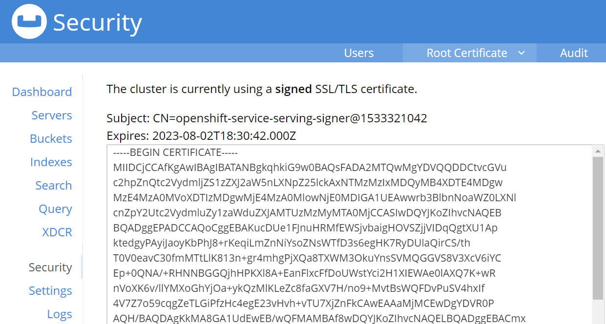

+++
title= "Configuring couchbase SSL for dynamic certificates in Openshift"
date= "2019-08-28"
tags= ["Openshift", "couchbase", "ssl"]
slug="couchbase-ssl-openshift"
+++

## Couchbase SSL

If you have followed [dynamic creation of java keystores in openshift](https://developers.redhat.com/blog/2017/11/22/dynamically-creating-java-keystores-openshift/) post and wondered how to use similar concepts for couchbase database and a java application. This post will help you.

### Couchbase setup

This is the couchbase [documentation](https://docs.couchbase.com/server/6.0/manage/manage-security/configure-server-certificates.html#configure-server-side-certificates) for configuring server side certificates, we are interested in last few steps since openshift will generate key and cert by adding annotation to the couchbase service.

**Note:** By adding this annotation you can [dynamically create certificates](https://docs.openshift.com/container-platform/3.11/dev_guide/secrets.html#service-serving-certificate-secrets)
`service.alpha.openshift.io/serving-cert-secret-name: couchbase-db-certs`

couchbase service looks like this:

```yaml
apiVersion: v1
kind: Service
metadata:
  annotations:
    kubectl.kubernetes.io/last-applied-configuration: ""
    service.alpha.openshift.io/serving-cert-secret-name: couchbase-db-certs
  labels:
    component: couchbase-db
  name: couchbase-db
  namespace: myproject
spec:
  ports:
    - name: consolerest
      port: 8091
      protocol: TCP
      targetPort: 8091
```

To convert certificates as couchbase expects, we are going to use an [init container](https://docs.openshift.com/container-platform/3.11/architecture/core_concepts/pods_and_services.html#pods-services-init-containers).

We will use an `emptyDir` volume to store cert and key in `/opt/couchbase/var/lib/couchbase/inbox/` location so that couchbase can access them.

Init container will run sequence of commands to split certificate, place them into `/opt/couchbase/var/lib/couchbase/inbox/` location and name cert file as `chain.pem`, key as `pkey.key`.

init container will look as follows:

```yaml
initContainers:
  - args:
      - "-c"
      - >-
        csplit -z -f crt- $crtfile '/-----BEGIN CERTIFICATE-----/' '{*}'
        && for file in crt-*; do cat $file >
        /opt/couchbase/var/lib/couchbase/inbox/service-$file; done && cat
        $crtfile > /opt/couchbase/var/lib/couchbase/inbox/chain.pem && cat
        $keyfile > /opt/couchbase/var/lib/couchbase/inbox/pkey.key
    command:
      - /bin/bash
    env:
      - name: keyfile
        value: /var/run/secrets/openshift.io/services_serving_certs/tls.key
      - name: crtfile
        value: /var/run/secrets/openshift.io/services_serving_certs/tls.crt
      - name: password
        value: changeit
    image: registry.access.redhat.com/redhat-sso-7/sso72-openshift:latest
    imagePullPolicy: Always
    name: couchbase-ssl
    volumeMounts:
      - mountPath: /var/run/secrets/openshift.io/services_serving_certs
        name: couchbase-db-certs
      - mountPath: /opt/couchbase/var/lib/couchbase/inbox/
        name: couchbase-ssl-volume
volumes:
  - emptyDir: {}
    name: couchbase-ssl-volume
  - name: couchbase-db-certs
    secret:
      defaultMode: 420
      secretName: couchbase-db-certs
```

Next add `couchbase-ssl-volume` emptyDir volume mount to actual container so file can be access by couchbase.

```yaml
spec:
  containers:
    - env:
      ...
      volumeMounts:
        - mountPath: /opt/couchbase/var/lib/couchbase/inbox/
          name: couchbase-ssl-volume
```

I am using a `rhel7-couchbase` image, on startup it runs a initialization script to setup cluster; at that time we will upload the certificate, and activate it using these commands.

```bash
couchbase-cli ssl-manage -c http://localhost:8091 -u Administrator \
-p password --upload-cluster-ca=${SERVICE_CERT}
couchbase-cli ssl-manage -c http://localhost:8091 -u Administrator \
-p password --set-node-certificate
```

Pass the cert location as environment variable `SERVICE_CERT` in deployment config.

```yaml
- env:
    - name: SERVICE_CERT
      value: /opt/couchbase/var/lib/couchbase/inbox/service-crt-01
```

Verify logs on container

```text
SUCCESS: Uploaded cluster certificate to http://localhost:8091
SUCCESS: Node certificate set
```

We can also verify in couchbase UI



At this point couchbase setup is done.

### Application setup

We will be using same steps as `SSL client` from [dynamically-creating-java-keystores-openshift](https://developers.redhat.com/blog/2017/11/22/dynamically-creating-java-keystores-openshift/) post

To make a secure connection to the couchbase, it will need the trust store generated by the `pem-to-truststore` initContainer. Here is the client’s app deployment config:

```yaml
- apiVersion: v1
  kind: DeploymentConfig
  metadata:
    labels:
      app: ssl-client
    name: ssl-client
  spec:
    replicas: 1
    selector:
      deploymentconfig: ssl-client
    template:
      metadata:
        labels:
          app: ssl-client
          deploymentconfig: ssl-client
      spec:
        containers:
          - name: ssl-client
            image: ssl-client
            imagePullPolicy: Always
            env:
              - name: JAVA_OPTIONS
                value: -Djavax.net.ssl.trustStore=/var/run/secrets/java.io/keystores/truststore.jks -Djavax.net.ssl.trustStorePassword=changeit
              - name: POD_NAMESPACE
                valueFrom:
                  fieldRef:
                    apiVersion: v1
                    fieldPath: metadata.namespace
            volumeMounts:
              - mountPath: /var/run/secrets/java.io/keystores
                name: keystore-volume
        initContainers:
          - name: pem-to-truststore
            image: registry.access.redhat.com/redhat-sso-7/sso71-openshift:1.1-16
            env:
              - name: ca_bundle
                value: /var/run/secrets/kubernetes.io/serviceaccount/service-ca.crt
              - name: truststore_jks
                value: /var/run/secrets/java.io/keystores/truststore.jks
              - name: password
                value: changeit
            command: ["/bin/bash"]
            args:
              [
                "-c",
                "csplit -z -f crt- $ca_bundle '/-----BEGIN CERTIFICATE-----/' '{*}' && for file in crt-*; do keytool -import -noprompt -keystore $truststore_jks -file $file -storepass changeit -alias service-$file; done",
              ]
            volumeMounts:
              - mountPath: /var/run/secrets/java.io/keystores
                name: keystore-volume
        volumes:
          - emtpyDir: {}
            name: keystore-volume
```

The next step is to enable encryption and pass the path and password of the truststore generated by the initContainer

```java
CouchbaseEnvironment  env = DefaultCouchbaseEnvironment.builder().sslEnabled(true)
  .sslTruststoreFile("/var/run/secrets/java.io/keystores/truststore.jks")
  .sslTruststorePassword("changeit").build();
cachedCluster = CouchbaseCluster.create(env, "couchbase-db")
  .authenticate("Administrator", "password");
```

Deploy your application, if successful you should see similar output in container logs

```log
2019-08-28 15:33:27.952  INFO 1 --- [cTaskExecutor-1]
com.couchbase.client.core.CouchbaseCore  : CouchbaseEnvironment:
{sslEnabled=true, sslKeystoreFile='null', sslTruststoreFile='/var/run/secrets/java.io/keystores/truststore.jks',
sslKeystorePassword=false, sslTruststorePassword=true,
sslKeystore=null, sslTruststore=null, bootstrapHttpEnabled=true,
 bootstrapCarrierEnabled=true, bootstrapHttpDirectPort=8091,
...
```
