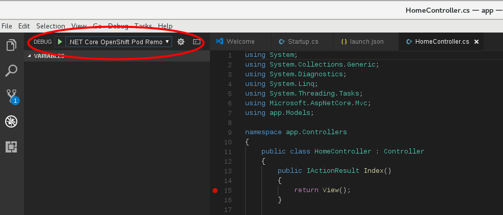

+++
title="Debugging a .NET Core application running on OpenShift"
date="2019-05-14"
tags=["OpenShift", "dot net"]
slug="debug-netcore-openshift"
+++

This post is about how to remote debug a ASP.NET Core application on OpenShift using Visual Studio Code. You can use any Microsoft proprietary debugger engine `vsdbg` with Visual Studio Code.

First, list the available .Net application pods using `oc` command.

```bash
$ oc get pod
    NAME                            READY     STATUS      RESTARTS   AGE
    MY_APP_NAME-3-1xrsp          0/1       Running     0          6s
$ oc rsh MY_APP_NAME-3-1xrsp
sh-4.2$  curl -sSL https://aka.ms/getvsdbgsh | bash /dev/stdin -v latest -l /opt/app-root/vsdbg -r linux-x64
```

**Note:** If you're container is running behind a corporate proxy and cannot access internet, you'll have to build base dotnet image with the debugger engine `vsdbg` installed in it.

Create (or open) the `.vscode/launch.json` file inside the source directory of the application (i.e. at same level as the project folder), then add the following:

```json
{
  "version": "0.1.0",
  "configurations": [
    {
      "name": ".NET Core OpenShift Pod Remote Attach",
      "type": "coreclr",
      "request": "attach",
      "processId": "1",
      "pipeTransport": {
        "pipeProgram": "oc",
        "pipeArgs": ["exec", "-it", "<replace-with-pod-name>", "--"],
        "quoteArgs": false,
        "debuggerPath": "/opt/app-root/vsdbg/vsdbg",
        "pipeCwd": "${workspaceRoot}"
      },
      "justMyCode": false,
      "sourceFileMap": { "/opt/app-root/src": "${workspaceRoot}" }
    }
  ]
}
```

In `Launch.json` replace `<replace-with-pod-name>` with the name of the pod.

Confirm the PID of the `dotnet` process in the container. If different, replace the `processId` in `launch.json` with appropriate value. Usually this value is `1`.

If the application is built with the `Release` configuration, which is the default for .NET Core S2I builder images, `justMyCode` should be `false`.

As S2I images build the source code located in the `/opt/app-root/src` folder, this is the path that should be specified for `sourceFileMap`.

Start debugging the .NET Core app by switching to the debug window, then select `.NET Core OpenShift Pod Remote Attach` as the configuration and click on the green play button (as shown below), or press F5 key.



Remember to add the breakpoints in the source code to see debugging in action!
